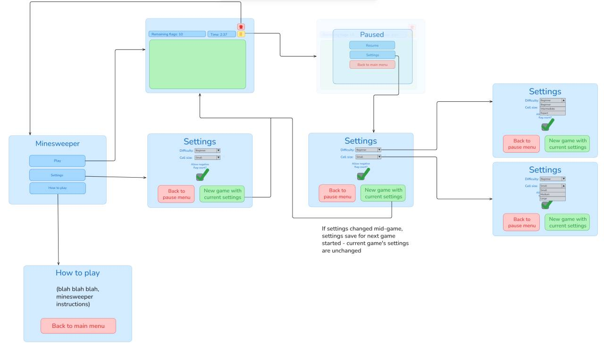

# Minesweeper

<p align="center">
  
  
  
  <a href="https://github.com/v-gajjar/Minesweeper/actions/workflows/build-checks.yaml">
    
  </a>
</p>

<p align="center">
  
  
  
</p>

<p align="center">
  
</p>

<p align="center">
  <strong>Play now:</strong><br />
  <a href="https://v-gajjar.github.io/Minesweeper/" target="_blank">Live Demo</a>
</p>

---

## About

A community-driven, open-source reimagining of the iconic Minesweeper game. Not another generic, copycat clone; We're evolving the game with modern styling and thoughtful UX for a variety of users. 

One stand out feature will be welcoming and approachable home screen:
- Easy access to game rules for new players
- Quick play convenience for experienced players
- Customistable settings for those wanting a more personalised experience
---

## Acknowledgements

Minesweeper is a community project, shaped by everyone who’s played, tested, and contributed.  
Every commit, idea, and bug report makes the game better.  

[](./CONTRIBUTORS.md)  

Meet all our amazing [Contributors](./CONTRIBUTORS.md)

---

## Architecture Overview



This diagram shows how the app’s components and game logic interact — from user input to board rendering and win/loss conditions.

For deeper technical details, see the [Architecture section in the Wiki](https://github.com/v-gajjar/Minesweeper/wiki#architecture).

---

## How to Play

Learn how to master Minesweeper from basic rules to advanced strategies in the official wiki guide:

[View How to Play in the Wiki](https://github.com/v-gajjar/Minesweeper/wiki#how-to-play)

---

## Roadmap

The Minesweeper project is continuously evolving through community-driven improvements and new features.

To view planned milestones, ideas under discussion, and in-progress updates, check the official wiki:

- [View the Roadmap in the Wiki](https://github.com/v-gajjar/Minesweeper/wiki#roadmap)
- [GitHub Issues](https://github.com/v-gajjar/Minesweeper/issues)

---

## Quick Start

For a full overview of how to get started, see the [Quick Start Guide](https://github.com/v-gajjar/Minesweeper/wiki#quick-start).

---

## Project Structure

For a full overview of the folder layout, component organization, and key files, see the [Project Structure](https://github.com/v-gajjar/Minesweeper/wiki#project-structure).

---

## Tech Stack

For a full overview of the current tech stack, see the [Tech Stack](https://github.com/v-gajjar/Minesweeper/wiki#tech-stack).

---

## Scripts

All development, testing, and deployment commands are documented in the wiki.  
Use this reference to learn how each script works and when to use it.

[View Scripts in the Wiki](https://github.com/v-gajjar/Minesweeper/wiki#scripts)

---

## Contributing

We love contributions of all kinds — whether it’s fixing a bug, improving documentation, or suggesting a new feature.  
Your support helps shape the game’s future.

Before you dive in, please read through our
[Code of Conduct](https://github.com/v-gajjar/Minesweeper/wiki#code-of-conduct).  We value kindness and collaboration.
Next, take a look at the [Contributing Guide](https://github.com/v-gajjar/Minesweeper/blob/develop/CONTRIBUTING.md) to learn how to get your first PR merged smoothly.

> Don’t worry if you’re new! We’re happy to help guide you through setup, testing, or PR feedback — the goal is collaboration, not perfection.

---

## Attributions

- [Inter font](https://rsms.me/inter/) by Rasmus Andersson — licensed under the [SIL Open Font License 1.1](https://openfontlicense.org/).
- [Phosphor Icons](https://phosphoricons.com/) — licensed under the [MIT License](https://github.com/phosphor-icons/homepage/blob/master/LICENSE).

---

## Repository Notes

This repo was renamed from **React-Minesweeper** → **Minesweeper** (May 24, 2025).  
If you cloned the old repo, update your remote with:

```bash
git remote set-url origin https://github.com/v-gajjar/Minesweeper.git
```

---

## License

Licensed under the [MIT License](./LICENSE).
